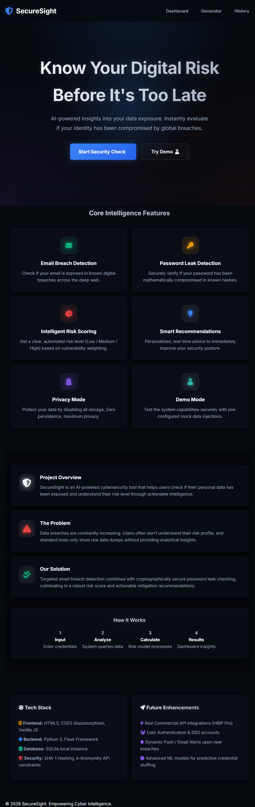
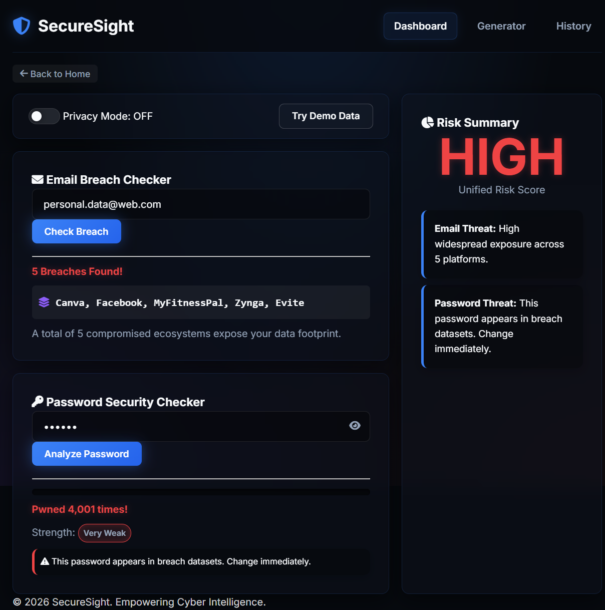
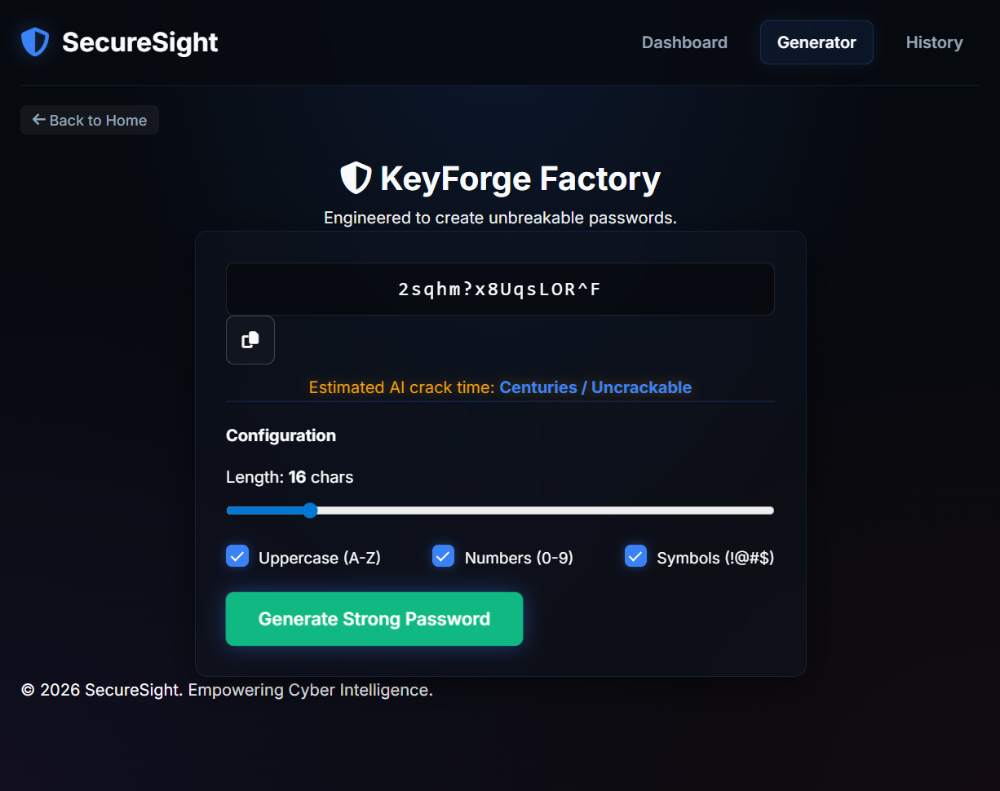

<div align="center">

# 🛡️ SecureSight: Data Leak Tracker

**An Intelligent Risk Scoring & Data Leak Analysis Web Application**

[](https://www.python.org/)
[](https://flask.palletsprojects.com/)
[](https://www.sqlite.org/)
[](https://developer.mozilla.org/en-US/docs/Web/JavaScript)
[]()

</div>

---

## 📖 Overview

**SecureSight** is a premium cybersecurity web application designed to help users identify their digital exposure across the internet. By combining local threat intelligence mapping with secure real-time API integrations, SecureSight delivers a comprehensive risk score and actionable defense recommendations—all without compromising user privacy.

---

## ⚠️ Problem Statement

With data breaches becoming increasingly common, users often remain completely unaware that their sensitive credentials (emails, passwords, SSNs) are exposed on the deep web. Existing tools often either lack context, provide confusing technical data, or compromise privacy by logging the very plain-text passwords they claim to protect.

---

## 🎯 Solution

SecureSight solves this by utilizing an **intelligent rule-based scoring system**. It securely checks credentials against known breach repositories without ever transmitting or storing plaintext user data. It then contextualizes the threat, calculating a clear Low, Medium, or High risk score backed by human-readable security recommendations.

---

## ✨ Features

* 📧 **Email Breach Scanner:** Cross-references emails against contextual threat-intelligence datasets.
* 🔑 **Password Vulnerability Engine:** Safely validates credential leaks and strength using the k-Anonymity privacy model.
* 🧠 **Intelligent Risk Scoring:** Computes aggregated risk profiles based on exposure frequency and data-sensitivity metrics.
* 🛡️ **Zero-Trace Privacy Mode:** A specialized toggle that halts all internal database logging for complete querying anonymity.
* ⚡ **Secure Password Generator:** Generates cryptographically secure, high-entropy strings using OS-level hardware noise (`crypto.getRandomValues`).
* 🎨 **Modern Interface:** Implements a fully responsive, visually striking UI featuring dark mode and glassmorphism.

---

## 📸 Application Screenshots

<p align="center">
  <figure style="display:inline-block; text-align:center; margin:10px;">
    
    <figcaption>Home Page</figcaption>
  </figure>
  <figure style="display:inline-block; text-align:center; margin:10px;">
    
    <figcaption>Dashboard</figcaption>
  </figure>
  <figure style="display:inline-block; text-align:center; margin:10px;">
    
    <figcaption>Generator</figcaption>
  </figure>
</p>

---

## ⚙️ How It Works

1. **User Input:** The user submits their email or password securely via the dashboard.
2. **Local Processing:** Passwords are cryptographically hashed (SHA-1) by the backend via `password_checker.py`.
3. **Secure Verification:** Only the first 5 characters of the hash are transmitted securely to an external vulnerability database (HIBP).
4. **Threat Matching:** `breach_checker.py` correlates the email against known threat feeds.
5. **Risk Aggregation:** `risk_model.py` evaluates all data and compiles a final threat score.
6. **Result Output:** The Flask API returns JSON payloads mapped into dynamic, color-coded UX advisories.

---

## 🏗️ System Architecture

The application is built on a modular Full-Stack MTV (Model-Template-View) design pattern. The frontend leverages fully asynchronous vanilla JavaScript to retrieve API JSON payloads without reloading the DOM. The backend utilizes Flask as a lightweight routing layer seamlessly communicating with localized analysis scripts and SQLite storage arrays.

User Input → Frontend (JS) → Flask API → Processing Modules (`breach_checker.py`, `password_checker.py`, `risk_model.py`) → Database Log → Output Render


---

## 🗺️ Architecture Diagram

┌─────────────────────────────────────────────────────────────────────┐
│                         CLIENT BROWSER                              │
│                                                                     │
│   ┌───────────────┐   ┌────────────────┐   ┌──────────────────┐     │
│   │  HTML5/Jinja2 │   │ Vanilla JS ES6 │   │  CSS3 Glassmor-  │     │
│   │  Templates    │   │  Fetch API /   │   │  phism + Neon UI │     │
│   │               │   │  DOM Manip.    │   │                  │     │
│   └──────┬────────┘   └───────┬────────┘   └──────────────────┘     │
│          │                    │ JSON POST /api/scan                 │
└──────────┼────────────────────┼─────────────────────────────────────┘
           │                    │
           ▼                    ▼
┌─────────────────────────────────────────────────────────────────────┐
│                        FLASK BACKEND                                │
│                                                                     │
│   ┌──────────────────────────────────────────────────────────────┐  │
│   │                        app.py (Router)                       │  │
│   │   /            /dashboard     /history     /api/scan (POST)  │  │
│   └──────┬──────────────┬──────────────┬───────────────┬─────────┘  │
│          │              │              │               │            │
│          ▼              ▼              ▼               ▼            │
│   ┌────────────┐ ┌─────────────┐ ┌─────────┐ ┌────────────────── ┐  │
│   │ index.html │ │dashboard    │ │history  │ │  breach_checker   │  │
│   │ (Landing)  │ │.html (Main) │ │.html    │ │  .py              │  |
│   └────────────┘ └─────────────┘ └─────────┘ └──────── ┬─────────┘  │
│                                                        │            │
│   ┌──────────────────────────────────────────────────┐ │            │
│   │                  utils/                          │ │            │
│   │  ┌──────────────┐  ┌──────────────┐  ┌────────┐  │ │            │
│   │  │password_     │  │ risk_model   │  │ db.py  │◄ ┘ │            │
│   │  │checker.py    │  │ .py          │  │        │    │            │
│   │  │(k-Anonymity) │  │(Score Engine)│  │(SQLite)│    │            │
│   │  └──────┬───────┘  └──────┬───────┘  └───┬────┘    │            │
│   └─────────┼─────────────────┼──────────────┼─────────┘            │
│             │                 │              │                      │
└─────────────┼─────────────────┼──────────────┼──────────────────────┘
              │                 │              │
              ▼                 │              ▼
┌─────────────────────┐         │    ┌──────────────────────┐
│  HIBP EXTERNAL API  │         │    │   SQLite Database    │
│  api.pwnedpasswords │         │    │   securesight.db     │
│  .com/range/{prefix}│         │    │   (search_history)   │
└─────────────────────┘         │    └──────────────────────┘
                                ▼
                   ┌─────────────────────────┐
                   │ data/mock_breaches.json │
                   │ (Threat Intelligence DB)│
                   └─────────────────────────┘

## 🔌 API Documentation

### POST `/api/scan`

Scans an email and/or password for known vulnerabilities.

**Request JSON:**
```json
{
  "email": "user@example.com",
  "password": "mySecurePassword123",
  "privacy_mode": true
}
```

**Response JSON:**
```json
{
  "unified_risk_score": "Medium",
  "dynamic_advice": {
    "email_advice": "Change passwords on affected platforms.",
    "password_advice": "Safe from known lists, but ensure complexity."
  },
  "email_results": {
    "email_scanned": "user@example.com",
    "breach_count": 2,
    "breaches": ["Platform A", "Platform B"]
  },
  "password_results": {
    "password_scanned": "Yes",
    "pwned_count": 0,
    "strength_score": 3,
    "strength_label": "Good"
  },
  "recommendations": [
    "🟡 Consider upgrading your password.",
    "🟢 Enable Two-Factor Authentication."
  ]
}
```

---

## 📂 Project Structure

```text
SecureSight/
├── app.py                      # Primary Flask application server
├── securesight.db              # SQLite Database
├── requirements.txt            # Python dependencies
├── README.md                   # Documentation
├── database/
│   └── db.py                   # SQLite query routing and tracking models
├── utils/
│   ├── breach_checker.py       # Email leak analysis parsing
│   ├── password_checker.py     # Hash validation and k-anonymity logic
│   └── risk_model.py           # Intelligent weighting algorithms
├── static/
│   ├── css/
│   │   └── style.css           # Glassmorphic UI parameters
│   └── js/
│       └── main.js             # Async DOM manipulation and generation logic
└── templates/
    ├── landing.html            # Landing sequence
    ├── dashboard.html          # Core scanner application
    ├── generator.html          # Secure cryptographic generation
    └── history.html            # Query history tracking board
```

---

## 🎭 Demo Mode

SecureSight includes a **multi-scenario randomized demo system** explicitly engineered for software demonstrations and stakeholder review. 

By clicking "Try Demo" in the UI, the application bypasses standard inputs and randomly executes across an array of 9 complex engineered scenarios. These scenarios dynamically showcase exactly how the application behaves mathematically when encountering `Low`, `Medium`, and `High` threat ecosystems without requiring you to use your own sensitive data.

---

## 🔒 Privacy & Security Design

Data security is the fundamental architectural pillar of this application.

*   **The k-Anonymity Model:** The external APIs we use never receive plaintext passwords. Strings are converted using `SHA-1 hashing (local)`, and only the first 5 characters (prefix) are sent across the network.
*   **No Plaintext Storage:** The application mathematically guarantees that no plaintext passwords will ever be saved to the underlying SQLite arrays.
*   **Zero-Trace Privacy Mode:** When users enable "Privacy Mode," the backend implicitly skips the database SQL `.execute()` injection entirely, providing a 100% ephemeral processing session.

---

## 🚀 Installation & Setup

1. **Clone the repository:**
   ```bash
   git clone <https://github.com/Rohitgurjar345/SecureSight-AI-Powered-Data-Leak-Tracker.git>
   cd SecureSight
   ```

2. **Set up a Python Virtual Environment:**
   ```bash
   python -m venv venv
   source venv/bin/activate  # On Windows: venv\Scripts\activate
   ```

3. **Install Dependencies:**
   ```bash
   pip install -r requirements.txt
   ```

4. **Initialize the Setup:**
   ```bash
   python app.py
   ```
   > The `securesight.db` architecture initializes instantly upon routing.

---

## 💻 Usage Instructions

1. Access the web terminal at: `http://127.0.0.1:5000/`.
2. Navigate to the **Scan Dashboard**.
3. Input credentials (e.g., `alice@example.com`) to evaluate exposure against the simulation mock breaches.
4. Utilize the **Demo Toggle** for one-click randomized testing loops.
5. Review results on the dynamic risk panel.

---

## ⭐ Key Highlights

*   Implements k-Anonymity privacy model
*   Modular architecture for scalability
*   Real-world cybersecurity simulation
*   Interactive UI with modern design
*   Privacy-first system design
---

## 🥇 What Makes This Project Unique

Unlike standard password-strength checkers that use basic regular expressions, SecureSight unifies three independent evaluation environments (Local Exposure, Global Leaks, Contextual Weakness) into a single overarching **Rule-Based Analysis System**. You are not simply told "Password Bad." SecureSight analyzes precisely *why* you are compromised and returns mathematically targeted remediation paths.

---

## 🚀 Future Improvements

*   Real-time breach API integration
*   User authentication system
*   Email alert notifications
*   Machine learning-based risk prediction
*   Cloud deployment (AWS / Docker)


